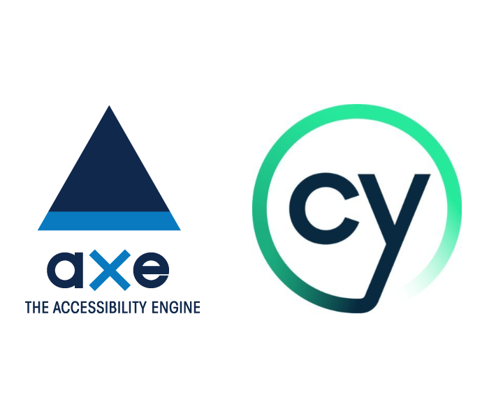

<h1 align="center">Automation Project For Accessibility Testing Using Cypress And Axe </h1>

## Summary

This is a project which aims to be used as a reference of how to setup and use Cypress and Axe for accessibility automation testing purposes.

## Setting the project up

In order to run this project follow this simple steps:

- Install Node.js 12 or 14 and above;
- Clone the project;
- In the root directory: run `npm install` in order to download the dependencies needed for the project;
